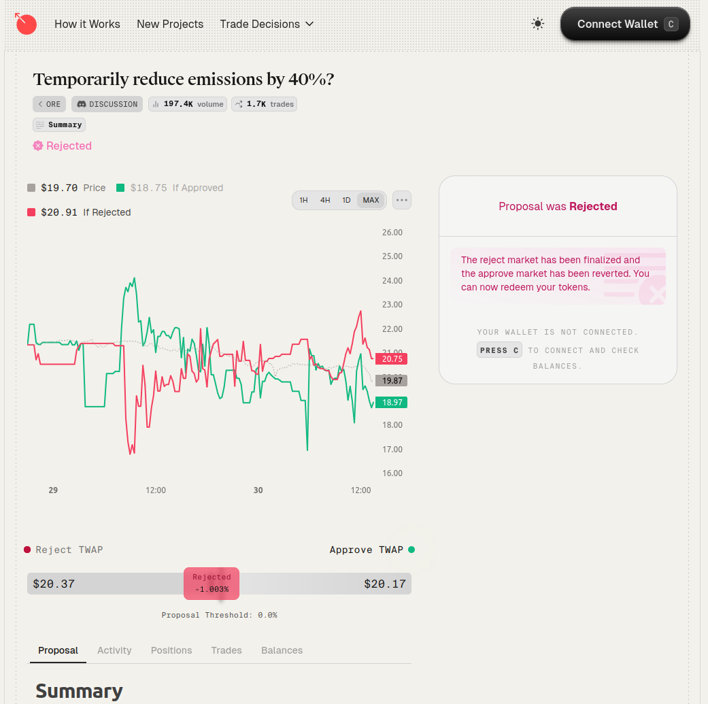

## Overview

Once a proposal has accumulated enough stake, the project takes half of its liquidity from the spot (e.g. META/USDC)
market and moves it into a proposal's conditional markets.

Traders can then make *conditional trades* over 3 days. **Conditional trades are like normal trades, except they
revert if the condition isn't met.**

## Example: Participating in the ORE Market

If you thought that ORE would have been worth more than $19 if they reduced their emissions by
40%, you could have participated in [this market](https://metadao.fi/ore/trade-v4/3PCPkFQQo7sU2DxpqnQNEttiyx1t5kByY2WPjCo1qLEZ):

If you believed that ORE would go to \$30 if they adopted this change, you could have bought ORE in the pass market.
For example, you could have placed a trade of \$1000 for 50 ORE (\$20 per ORE).

Then, if the proposal passes, you would have bought ORE at $20. But if it fails, you wouldn't have bought any ORE.

## How you can preserve & grow your portfolio by trading decision markets

### Case #1 - Bad Proposal

Suppose there's a project, EXMPL, that has \$1M in its treasury and a \$1.2M
market cap. You own $10,000 worth of the token.

The founder just raised a proposal to send all of the project's money to himself
so that he can go on a nice vacation.

The market immediately reacts to this information and the token shoots down to a
\$900k market cap. But so far, no one has traded the decision markets, so it's trading
\$900k in both the pass and fail markets - what should you do?

One reasonable course of action would be to sell pass and buy fail. Pass is 
overvalued at \$900k if you think the token will go to 0 if the founder walks
away with all of the money. And fail is undervalued at \$900k if you think that
the immediate next proposal will be to liquidate, netting you a nice 11% profit.
You're prepared for either scenario.

### Case #2 - Good Proposal

Now suppose there's another project called XYZ with \$10M in revenues and a \$100M market
cap. So it's trading at a price-to-sales multiple of 10.

The founder just created a proposal to add a new business line.

You think that this business line will add \$5M of revenue to the project, translating to
\$50M in market cap.

Here, your course of action should totally depend on the prices of the decision markets.
If the pass market is already pricing the token at \$150M, you shouldn't take any trades.

But if it's trading at \$110M in the pass market, you probably want to buy. If it's trading
at \$200M, you probably want to sell.

And if you think that \$100M is the fair value for the project if the proposal fails, you
would probably want to buy the fail market at below \$100M and sell it above \$100M.

