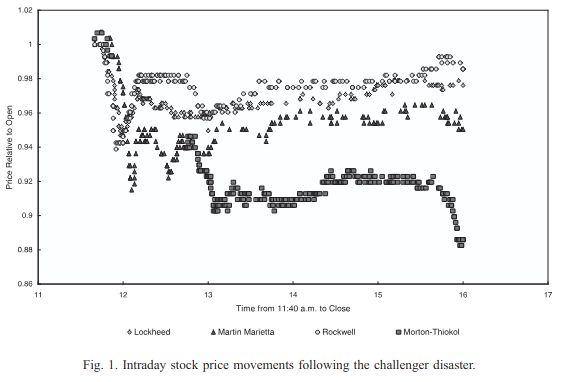

## First, some background

MetaDAO originally started as a governance project - since November 2023 we've run 96 proposals
for 14 organizations. 

Decisions made on MetaDAO include:
- [Jito's fee switch decision](https://metadao.fi/jito-dao/trade/CJW4iZPT14sVNzoc4Yibx1LbnY12sA75gZCP9HZk11UA)
- [Flash's decision to start passing revenue back to stakers](https://metadao.fi/flash-trade/trade-v4/3kfEHobCtMn4rDCXmo2H735xX6oEacVN1DBuL41wj7az)
- [All of Sanctum's governance decisions](https://metadao.fi/sanctum)

The difference between governance on MetaDAO and elsewhere is that there isn't any voting, only trading.
This system of governance is called futarchy, pronounced few-tar-key.

## How does it work?

TL;DR:
- People trade in markets that correspond to "what would be the value of this token if this proposal passed?" and
"what would be the value of this token if this proposal failed?"
- Organizations accept a proposal when traders think it will make the token's value increase and reject them
when traders think it will make the token's value decrease

Here's its inventor Robin Hanson to explain the concept:
<iframe width="560" height="315" src="https://www.youtube.com/embed/PRog7R37MA0?si=eo_wGVzLtSnxS16X" title="YouTube video player" frameborder="0" allow="accelerometer; autoplay; clipboard-write; encrypted-media; gyroscope; picture-in-picture; web-share" referrerpolicy="strict-origin-when-cross-origin" allowfullscreen></iframe>

## Why is it better?

Markets have a long track record of predicting the future better than alternatives. For example:
- [Prediction markets have historically beaten pollsters at predicting election results.](https://www.biz.uiowa.edu/faculty/trietz/papers/long%20run%20accuracy.pdf)
- [Orange juice futures markets have historically predicted the weather better than
government forecasts.](https://www.asecib.ase.ro/mps/TheWisdomOfCrowds-JamesSurowiecki.pdf)
- [In 1986 when the Challenger Space Shuttle exploded over Cape Canaveral, it took the government
4 months to identify Morton-Thiakol's O-Rings as the root cause. The market had figured it out 
within 16 minutes.](https://maloney.people.clemson.edu/challenger.pdf)

See how Morton-Thiakol's stock price reacted versus the other government contractors involved
in the project:

## Why does it matter?

We don't know if decision markets are quite at that level of intelligence yet, but they appear
to already be better than token-voting at preventing capture.

Concretely, this means it is harder to rug ICOs when the funds are stored in futarchy.

Or, in the words of [Kevin Heavey](https://www.umbraresearch.xyz/writings/futarchy),

> Futarchy is such a radical improvement over majoritarian DAOs that even in its infancy it should already be ordained as the default governance mechanism, perhaps with training wheels like a security council to veto exploits.  
> All DAOs that persist with token voting over futarchy should begin to feel increasingly uncomfortable, because in time it will be assumed that any DAO still carrying on this way is malicious or incompetent... If you want people to share ownership of your business, you either become a normal company with no governance token, or you bind your fate to futarchy and let the market decide.  
> *Futarchy as Trustless Joint Ownership*, Umbra Research

