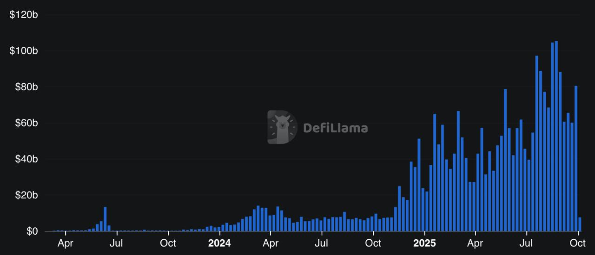

## Community ownership matters

Projects grow faster when they have an army of bagholders supporting them:

[//]: # (TODO: add links on stablecoin market cap to DeFillama and developer count on electric report and faster and cheaper)

[//]: # (- Ethereum did an ICO for 85% of its supply. It remains dominant on metrics like stablecoin market cap and
developer count despite Solana being 10x faster and 1000x cheaper.)
- Hyperliquid distributed 33% of its supply to its users. [Its perp volume 6xed](https://defillama.com/protocol/perps/hyperliquid).
- Yearn distributed 100% of its supply to its early users. [It subsequently rose from an \$8M TVL project
to a \$6B TVL project without incentives.](https://defillama.com/protocol/yearn)
- MegaETH sold tokens in an Echo round to 2,900 people. [Its Kaito mindshare 15xed.](https://x.com/sandraaleow/status/1889658182458597445)

The above graph shows Hyperliquid volume over time. Can you see the point at which they launched a token?

## But most tokens are done poorly

There are many problems with the standard playbook for doing a token. These include:
- **Rampant insider dealings have led to a loss of trust**: hidden OTC deals, special insider payouts from the foundation, and the like have made many investors wary of tokens.
- **The tokens themselves have very little fundamental value**: because there aren't any legal protections, nothing stops revenue from flowing to the team or a labs entity.
- **Frontloaded demand and backloaded supply contribute to structurally lower prices over time**: because most of their supply is vested over 2-3 years, these tokens need
a large amount of incremental buy pressure to maintain their prices. This is at odds with hype and demand being concentrated around launch date.

[Felipe Montealgre](https://twitter.com/TheiaResearch), a liquid token investor, describes these problems and others in his talk:
 
 <iframe width="560" height="315" src="https://www.youtube.com/embed/99XsVSN_doQ?si=inP_4ZLnS0hLaID2" title="YouTube video player" frameborder="0" allow="accelerometer; autoplay; clipboard-write; encrypted-media; gyroscope; picture-in-picture; web-share" referrerpolicy="strict-origin-when-cross-origin" allowfullscreen></iframe>

## MetaDAO is for founders who want to launch a token the right way

MetaDAO's core principles are:
- **Fair launch early**: instead of launching at a high FDV, projects launch early with high-float ICOs so that they can grow over time.
- **Real ownership and unruggability**: the most important parts of the project -
the intellectual property, the funds, and the ability to mint new tokens - are controlled by market-driven governance.
This imbues the token with value and prevents malicious teams from rugging the treasury.
- **Pay-for-performance**: insiders unlocks are proportional to the premium over the launch price. This keeps teams and participants aligned.

While much of crypto concerns itself with how to maximally extract value over the short-term, MetaDAO is built from the
ground up for long-term founders and their communities.